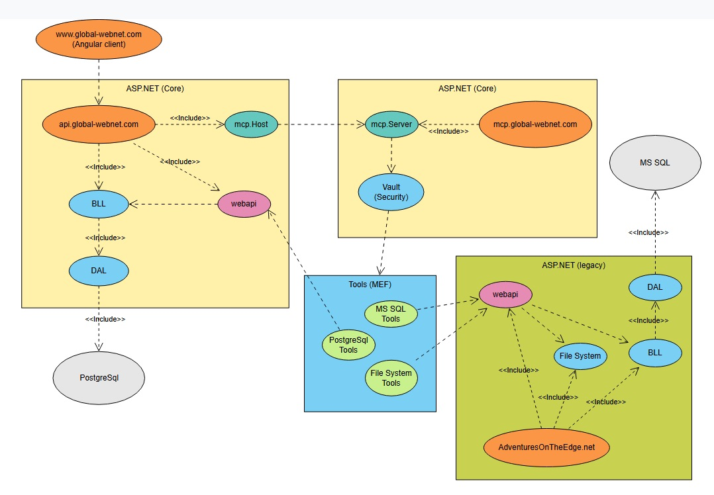
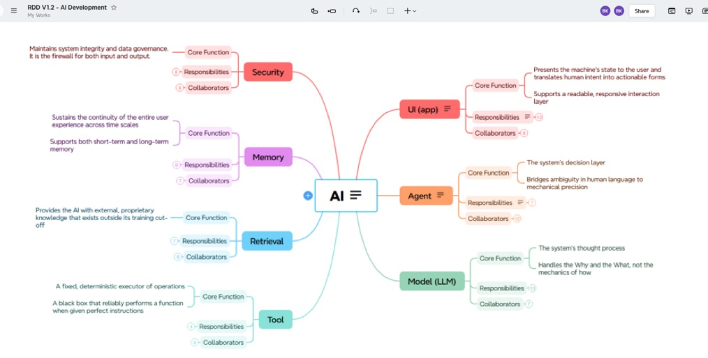

# ai-research-blog

AI Research Blog is an early-stage, open-source replacement for
[AdventuresOnTheEdge.net](https://AdventuresOnTheEdge.net), currently powered by a legacy private
[BlogEngine.NET fork](https://github.com/BillKrat/BlogAI). It is being built as an Angular and
ASP.NET Core application, with Aspire providing the local development composition.

- [AGENTS.md](AGENTS.md) — AI context index: repo state, per-AI sections, docs index

## Current State

The foundation is running today: an Angular client is deployed at
[www.global-webnet.com](https://www.global-webnet.com), backed by the ASP.NET Core API at
[api.global-webnet.com](https://api.global-webnet.com/api/health). The application includes
health monitoring, JWT-based user authentication, and machine-to-machine client-credentials
support. Reusable identity, security, and PostgreSQL data-access capabilities live in the
separate `Adventures.Foundation` packages.

A second site, `mcp.global-webnet.com`, now exists as well — as of 2026-09-23 it's a deliberate,
scoped-down pipeline shakedown (a single M2M-authenticated "hello world" endpoint that
`api.global-webnet.com`'s health check calls and reports back), not yet the real MCP Server
described below. It exists to prove the provisioning, deployment, and cross-site authentication
mechanics actually work before any real MCP tooling gets built on top of them.

## Vision

The API will evolve into an MCP Host that coordinates AI-assisted research and authoring. It will
call a separate, consolidated MCP Server over scoped machine-to-machine authentication. That
server will load independently developed tool modules -- such as PostgreSQL, SQL Server, and file
search -- so each tool retains control of its own data access and credentials.

### Security Across MCP Components

The MCP Host and Server will trust each other through short-lived, scoped machine-to-machine
tokens. The Host authenticates as its own client identity, requests only the scopes required for a
tool operation, and sends the resulting bearer token to the MCP Server. The server validates the
token and scope before invoking a tool; database, file-system, and other sensitive credentials
remain within the tool server and are never passed through the Host or exposed to the client.

Over time, the product will provide a modern research and blogging experience, while the related
BlogAI vision explores reviewable, searchable development narratives for AI-assisted code changes.

The following is a screenshot of the [AI research](https://app.xmind.com/ftOSfVNH?xid=qMtMXB9B) that will be used in design of MCP Host and Servers

## How this gets deployed: SmarterASP.NET + Claude Code

Worth an honorable mention: on 2026-09-23, the entire `mcp.global-webnet.com` shakedown described
above — a new hosted site, its DNS record, a free SSL certificate, a dedicated IIS application
pool, a scoped FTP account, and a new GitHub Actions deployment workflow — was provisioned and
shipped in a single evening session, almost entirely through natural-language requests to
[Claude Code](https://claude.com/claude-code) talking directly to SmarterASP.NET's new MCP server
integration. No manual clicking through the hosting control panel for the routine parts: create
the site, attach the domain, request the certificate, create the FTP user, check on provisioning
status — all of it happened as tool calls in a chat session, with the actual application code (the
`McpServer.WebApi` project, its tests, and the machine-to-machine auth wiring in
`AiBlogResearch.WebApi`) written, tested, committed, and deployed the same sitting.

**The guardrails did their job too, worth calling out honestly rather than glossing over.** Two
writes were blocked outright by Claude Code's own safety layer, independent of anything
SmarterASP.NET itself would have allowed: overwriting an already-live production secret, and
deleting a secret at all. A third attempt — minting a test token with the real signing key written
into a scratch file — was blocked as credential leakage before it ever touched disk. All three
required a human to finish by hand in the SmarterASP.NET panel. That's the system working as
intended: an AI agent with real infrastructure access, but with hard lines it won't cross on its
own around live credentials.

For a solo or small-team developer, the combination is genuinely inexpensive: a SmarterASP.NET
Windows hosting plan (around $38/month in this project's own case) that supports
[.NET Aspire](https://learn.microsoft.com/dotnet/aspire/) for local development composition and
deploys straight from GitHub Actions to that same hosting account, alongside a Claude
subscription doing the actual engineering work. That's a full multi-site .NET hosting environment
with real CI/CD, for less than the cost of a lot of single-purpose SaaS tools combined.

If you're evaluating SmarterASP.NET,
[this link](https://www.smarterasp.net/index?r=billkrat) supports this project.
