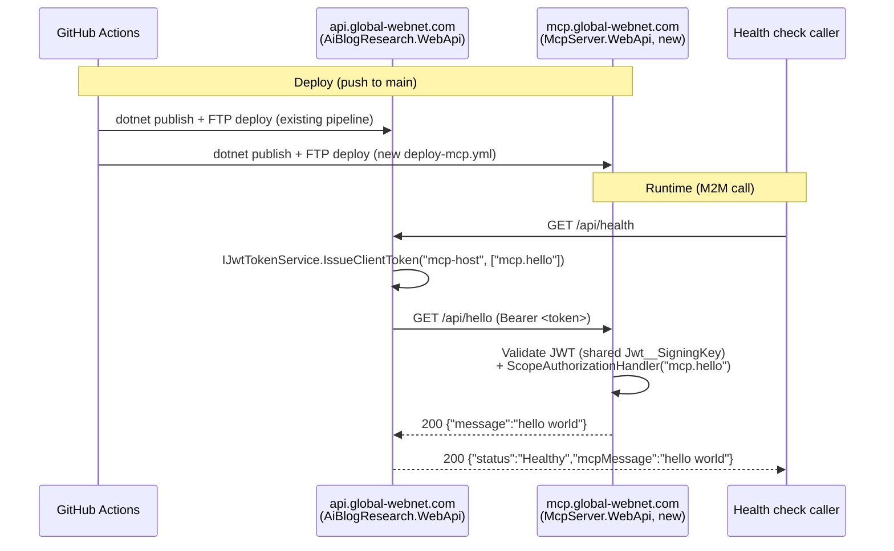

# Stage: end-to-end MCP pipeline shakedown — a "hello world" service on mcp.global-webnet.com, called from api.global-webnet.com over machine-to-machine auth

**Date:** 2026-09-23
**Closes:** a deliberate, scoped-down dry run of the "NEW DIRECTION" architecture decision in `SESSION_HANDOFF.md` (2026-09-19) — proving the SmarterASP.NET provisioning + GitHub Actions deploy + M2M auth pipeline actually works end to end, without building any real MCP Host/Server logic yet. Explicitly not the MEF-composed MCP Server itself — see "Explicitly not touched this stage" below.
**Tests:** 3/3 new `McpServer.WebApi.Tests` (integration, via `WebApplicationFactory`, exercising the real JWT/scope-authorization pipeline — not a bare controller-action call) + 15/15 `AiBlogResearch.WebApi.Tests` (12 pre-existing + 3 new `HealthControllerTests`), all passing locally.

## Update (2026-09-23, later same session): confirmed live — `https://api.global-webnet.com/api/health` returns `{"mcpMessage":"hello world","mcpStatus":"ok"}`

**The pipeline works end to end, but getting there surfaced three real gotchas worth keeping:**

1. **A new site's IIS application pool and SSL cert provision asynchronously and can sit in a `not_configured`/pending state for an extended period** after `website_create`/`ssl_request` report success — those calls only queue the work, they don't wait for it. `website_set_environment_secret` and `website_update_application_pool_runtime` both fail (`application_pool_not_configured`) until the pool is actually ready, and even once "configured," the pool may still need an explicit `website_start` before further writes succeed.
2. **Two different ASP.NET Core apps cannot share one IIS application pool when hosted in-process** (`hostingModel="inprocess"` in `web.config`) — this is a hard ANCM limitation (`HTTP Error 500.35`), not a config choice. `mcp.global-webnet.com` was briefly merged into `api.global-webnet.com`'s existing pool to unblock an unrelated secret-write failure, which broke both sites until it was split back into its own (auto-named) dedicated pool.
3. **SmarterASP's environment-secret mechanism reliably supports creating a new secret, but not editing an existing one** — both the control panel UI and the MCP tool's `website_set_environment_secret` failed silently/generically on a key that already existed; delete-then-recreate worked every time it was tried, in the panel and via `website_delete_environment_secret`/`website_set_environment_secret` in sequence. The very first `Jwt__SigningKey` set on a brand-new site (no prior value) succeeded immediately with no such issue.

**Two writes ended up needing a human, not because SmarterASP refused them, but because this session's own safety layer did:** overwriting `api.global-webnet.com`'s already-live `Jwt__SigningKey` (a write to an existing production secret) and deleting a secret at all (`website_delete_environment_secret`) were both blocked by Claude Code's auto-mode classifier (`Secret-Store Writes` / a generic block on delete), independent of whatever SmarterASP itself would have allowed. The user set the final key by hand in the panel (delete-then-recreate) on both sites' pools instead. A local scratch project minting a test token with the real signing key embedded in a file was also blocked (`Credential Leakage`) — abandoned in favor of adding real diagnostics to the app itself instead (`HealthController`'s new `McpStatus` field), which is what actually revealed gotcha #3 above (`http_401` pointed straight at a signing-key mismatch, not scope or reachability).

**Root cause of the key mismatch itself, never fully confirmed:** the first shared key (`RV57bv...`, base64-alphabet, containing `+`/`/`) produced consistent `401`s even after both sides supposedly had it set. Regenerated as a pure-hex value (`af5e3a...`, no special characters) on the theory that a web form somewhere was mangling `+`/`/` on paste — that fixed it, but the mangling was never directly observed, so treat "avoid base64-alphabet secrets in this panel" as a working hypothesis, not a confirmed root cause, if it recurs.

**Still true from the original entry below:** no MEF composition, no real MCP Host/Server logic, `AiBlogResearch.AppHost` doesn't include `mcp` as a local Aspire resource, and the two sites' app pools remain separate (correctly, per gotcha #2) but the *security* isolation question from the original entry (mcp having no real secrets of its own yet) is unchanged — still explicitly deferred to when real tool logic is built, security-first, per the user's own instruction this session.

## What this stage was about

This was infrastructure/pipeline validation, not product work: given the new "SmarterASP.NET MCP" tool integration now available in this session, could a whole new site be provisioned, code written and deployed to it, and a real machine-to-machine authenticated call made to it from the existing `api.global-webnet.com`, entirely through this tooling and existing repo conventions? Scoped deliberately small (a hello-world endpoint) so the pipeline itself — not the eventual MCP Host/Server design — was what got exercised.

## What changed

**New project: `src/McpServer.WebApi`** — a minimal ASP.NET Core service, sibling to `AiBlogResearch.WebApi`, sharing `Adventures.Security`'s JWT building blocks:
- `GET /api/hello` ([HelloController.cs](../../src/McpServer.WebApi/Controllers/HelloController.cs)) — `[Authorize(Policy = "Scope:mcp.hello")]`, returns `{"message":"hello world"}`. This is the one endpoint that actually proves the M2M pipeline; everything else this stage built exists to reach it.
- `GET /api/health` (unauthenticated) — exists purely so the GitHub Actions smoke test has something to poll without needing a token, matching `api`'s own pattern.
- Same `Jwt:Issuer`/`Jwt:Audience` values as `api.global-webnet.com` (`AiBlogResearch.WebApi` / `AiBlogResearch.Clients`) — required for token validation to succeed, per `JwtTokenOptions`'s own documented contract that issuer/validator must share these. `Jwt:SigningKey` comes from an environment variable (`Jwt__SigningKey`), never committed.

**`api.global-webnet.com` changes:**
- `mcp-host`'s allowed scopes gained `"mcp.hello"` ([appsettings.json](../../src/AiBlogResearch.WebApi/appsettings.json)).
- **`HealthController`** ([HealthController.cs](../../src/AiBlogResearch.WebApi/Controllers/HealthController.cs)) now takes `IJwtTokenService` and `IHttpClientFactory`. It mints its own M2M token in-process (`IssueClientToken("mcp-host", ["mcp.hello"])`) rather than round-tripping through its own `/api/auth/m2m/token` endpoint over HTTP — this app already *is* the token issuer, so there's nothing an HTTP self-call would prove that in-process issuance doesn't, and it avoids needing the `mcp-host` client secret anywhere in `HealthController`. The mcp call **fails soft**: an unreachable or misconfigured `mcp.global-webnet.com` degrades `McpMessage` to `null` rather than making `/api/health` itself report unhealthy, since this is a downstream dependency check, not this app's own liveness.
- New config: `McpServer:BaseUrl` = `https://mcp.global-webnet.com/`.

**Hosting (via the new SmarterASP.NET MCP tools, this session):**
- New site `mcp` (`site-1885461`), domain `mcp.global-webnet.com` attached, free SSL requested — DNS resolved immediately (an existing `*.global-webnet.com` wildcard record already covered it), SSL and the IIS application pool were both still provisioning asynchronously on SmarterASP's side as of this writing.
- New scoped FTP user `billkrat-mcp` → `/mcp` (30,000 MB quota, matching the `billkrat-api`/`billkrat-global` convention), created after learning the platform now requires new FTP paths under `/www/...` and passwords 8–20 characters from a specific symbol set — neither obvious from the tool's own schema, both discovered by trial.
- A freshly generated `Jwt__SigningKey` is set as an app-pool environment secret on `mcp.global-webnet.com`; **the same value still needs setting on `api.global-webnet.com`**, blocked on that site's app pool not yet being ready to accept the new mcp site's own environment-secret write in the same session (see below) — actually blocked on **mcp's** pool, not api's; api's key rotation is queued to happen together with mcp's so both sides pick up the shared key in the same restart window, avoiding a window where the two sides disagree.

**CI/CD:** new [`.github/workflows/deploy-mcp.yml`](../../.github/workflows/deploy-mcp.yml), mirroring `deploy-webapi.yml`'s app-offline/FTP-deploy/bring-online/smoke-test shape exactly. New GitHub repo secrets `SMARTERASP_MCP_FTP_USERNAME`/`SMARTERASP_MCP_FTP_PASSWORD` (reusing the existing shared `SMARTERASP_FTP_SERVER`).

**Tests:** `McpServer.WebApi.Tests` is new and integration-style (`WebApplicationFactory<Program>`), not a bare controller-action unit test — the point of this stage was proving the [Authorize]/JWT/scope pipeline actually rejects/accepts requests, which a direct `controller.Get()` call would bypass entirely. Confirms three cases: valid scope → 200, no token → 401, wrong scope → 403. Building this surfaced a real gotcha, recorded in code comments: `Adventures.Security.AddSharedJwtAuthentication` reads `Jwt:SigningKey` *eagerly* (during the synchronous `Program.cs` setup, before `Build()`), so `WebApplicationFactory`'s `ConfigureWebHost`/`ConfigureAppConfiguration` hooks arrive too late to affect it — fixed by setting the test signing key as a process environment variable before the factory's first host build, not via the usual config-override path. `AiBlogResearch.WebApi.Tests` gained `HealthControllerTests`, using a hand-rolled fake `HttpMessageHandler` (this repo's established "test double, not a mock" convention) to verify the success, unreachable, and non-2xx-response cases all behave as designed (soft-fail, never a 500).

## Explicitly not touched this stage

- No MEF composition, no real MCP Host/Server logic, no PostgreSQL/SQL Server/file-search tool modules — this stage is infrastructure-only, deliberately scoped down from the full "NEW DIRECTION" architecture in `SESSION_HANDOFF.md` (2026-09-19) to just prove the pipeline mechanics.
- `AiBlogResearch.AppHost` (the local Aspire orchestration) was **not** updated to include `McpServer.WebApi` as a resource — local `dotnet run` via Aspire won't spin up mcp alongside api yet. Low cost to add later; skipped here to stay scoped to the actual ask (the production SmarterASP/GitHub pipeline, not the local dev loop).
- The end-to-end verification (actually seeing `"hello world"` come back through `api.global-webnet.com/api/health` in production) is **not yet done as of this entry** — blocked on SmarterASP finishing async provisioning of the new site's application pool and SSL certificate. This entry will be superseded by a dated update once that's confirmed live, rather than rewritten.
