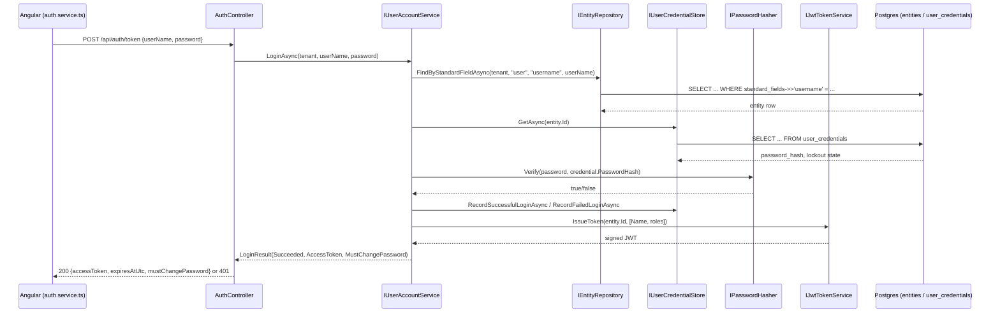

# Stage: replacing the demo-user login placeholder with real `Adventures.Identity` login

**Date:** 2026-09-21
**Closes:** the "Adventures.Identity" step 4 item open since `SESSION_HANDOFF.md` (retired 2026-09-25; see git history)'s 2026-09-19 entries ("deliberately not wired into `AuthController` yet").
**Tests:** 109/109 passing across the solution (24 Adventures.Data + 22 Adventures.Identity + 51 Adventures.Security + 12 AiBlogResearch.WebApi). Verified against the real dev Postgres, not just unit tests with a fake.

## What this stage was about

`AuthController` has been checking a config-seeded `DemoUser:UserName`/`DemoUser:Password` pair since the security foundation was first deployed — a placeholder, by design, until the real login path (`Adventures.Data` + `Adventures.Identity`, JSONB Hybrid + N-Quads over Postgres) was verified end-to-end. That verification happened on 2026-09-19 via a throwaway console app, but `AuthController` itself was deliberately left untouched until now. This stage finishes that: a real tenant-admin user now exists in the dev database, and `AuthController` calls `IUserAccountService.LoginAsync` instead of comparing against config values.

## What changed

**A real tenant-admin user now exists in the dev database** (`pg8001.site4now.net`/`db_a2cb58_aiblogdv`) — `entities` row (`entity_type = 'user'`, `tenant = 'global-webnet.com'`, `org = 'default'`, `username = 'Admin'`, `roles = ['TenantAdmin']`) plus a `user_credentials` row with a real PBKDF2-HMAC-SHA256 hash of `Password` (210,000 iterations, random salt — via `Adventures.Security.PasswordHasher`, not a placeholder string). `must_change_password = true`, same as `seed-tenant-admin.sql`'s own documented convention, so this isn't a standing weak credential. Seeded and verified via a throwaway console app (`Microsoft.Extensions.Configuration.UserSecrets` reading the same `ConnectionStrings:Postgres`/`Jwt:SigningKey` the real WebApi uses, against the actual published `Adventures.Data`/`Identity`/`Security` 0.2.2/0.1.0/0.1.0 NuGet packages, not source references) — never committed, same pattern as every prior verification in this doc's history.

**`AuthController`** ([Controllers/AuthController.cs](../../src/AiBlogResearch.WebApi/Controllers/AuthController.cs)) now takes `IUserAccountService` instead of `IJwtTokenService` directly, and `Token(...)` is `async`, calling `LoginAsync(Tenant, request.UserName, request.Password)`. `Tenant` comes from `Auth:Tenant` config, defaulting to `"global-webnet.com"` — this app is single-tenant today, so nothing in the Angular client needed to change to send a tenant. `TokenResponse` gained `MustChangePassword`, surfaced from `LoginResult` — nothing consumes it yet (no forced-change UI exists), but it's no longer silently dropped at the controller boundary.

**Verified for real, not just against a fake:** ran the WebApi locally against the live dev Postgres — correct credentials return a real JWT (`sub` = the entity's UUID, `roles` claim = `TenantAdmin`), wrong password and unknown username both return `401`, `/api/auth/whoami` correctly resolves `"Admin"` from the token, and no-token requests to it still `401`. `/api/health` re-checked afterward to confirm nothing else regressed.

**Test double, not a mock:** `AuthControllerTests.cs` was rewritten around a hand-rolled `FakeUserAccountService : IUserAccountService`, matching this codebase's established convention (no mocking library referenced anywhere in this solution).

## Explicitly not touched this stage

- No forced-password-change flow exists yet — `MustChangePassword` reaches the client now but nothing acts on it. The seeded `Admin`/`Password` account will happily keep logging in with that password indefinitely until one is built.
- `DemoUser:UserName`/`DemoUser:Password` are still sitting in local user-secrets, unused by any code now — harmless, but worth removing next time that file is opened.
- None of the POC's `GenericDal`/`GenericBll`/schema-metadata work (encryption, permission filtering, version-tagged Bll resolution) touched this path — this stage deliberately used the existing, already-decided `Adventures.Data`/`Identity` stack as-is, not a retrofit of the newer POC pattern. Different track, different timeline.
- Multi-tenant login (a client actually supplying which tenant) isn't wired — `Auth:Tenant` is a server-side config default, not a request field, since nothing needs more than one tenant yet.
