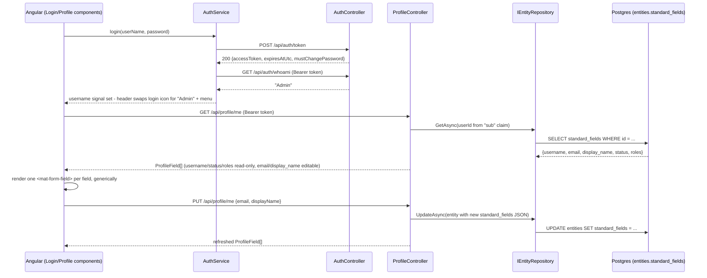

# Stage: a real login screen, end to end — login icon, username in header, Profile page with a schema-driven form

**Date:** 2026-09-24
**Closes:** the "NEXT UP" item queued in `SESSION_HANDOFF.md` (retired 2026-09-25; see git history) on 2026-09-23 evening — all three flagged gaps resolved, not deferred further.
**Tests:** 120/120 passing across the .NET solution (24 Adventures.Data + 51 Adventures.Security + 22 Adventures.Identity + 20 AiBlogResearch.WebApi, up from 12 — the new `ProfileController` tests) + 2/2 Angular unit tests (`ng test`). Also verified live in a real browser against the live dev Postgres (`pg8001.site4now.net`/`db_a2cb58_aiblogdv`), not just unit tests — see "Verified for real" below.

## What this stage was about

The queued ask: a login icon top-right of the header (Angular Material, matching the existing theme-toggle button), the logged-in user's **username** replacing it on success, a dropdown off that username opening a **Profile** page, and that page rendering via the same schema-driven generic-form technique `poc/nquad-end-to-end-poc`'s `app-screen.html` demonstrates — fields rendered by iterating metadata, not hand-coded per field. Three concrete gaps were flagged for this session to resolve, not re-defer:

1. **Getting the username to the client**, given the JWT's `sub` claim is a GUID and the username claim lands under an XML-namespace URI key.
2. **The client's `TokenResponse` interface silently dropping `mustChangePassword`.**
3. **No schema-driven form technique exists in this repo yet** — only the POC has it, and the POC's own `GenericDal`/`GenericBll` don't exist anywhere real.

## Decisions made on the two open gaps

**Gap 1 - chose option (b), `GET /api/auth/whoami`, not option (a).** Reflected directly against the published `Adventures.Identity` 0.1.0 DLL to settle this rather than guess: `LoginResult` has `Succeeded`/`AccessToken`/`ExpiresAtUtc`/`MustChangePassword`/`FailureReason` only — no username, no account. Adding it (option a) would have meant a new `Adventures.Foundation` method and a new package version just to unblock a header label. `/api/auth/whoami` already resolves the username correctly (confirmed again this session, live) with zero backend changes, so `AuthService.login()` now chains a `GET /api/auth/whoami` call right after the token call and stores the result in a `username` signal (persisted to `sessionStorage` so a page reload doesn't lose it, same pattern as the token/expiry storage).

**Gap 2 - `TokenResponse` now has `mustChangePassword`, still not acted on.** The client's `TokenResponse` interface gained the field and `AuthService` stores it in a `mustChangePassword` signal, so it's no longer silently dropped — but no forced-change UI was built. This is the third time that flow has been deferred (see the 2026-09-19 and 2026-09-21 entries); not re-litigated here, just kept consistent.

**Gap 3 - a real but modest profile form, not a `GenericDal`/`GenericBll` port**, per the recommendation already recorded in the "NEXT UP" entry. New `ProfileController` ([Controllers/ProfileController.cs](../../src/AiBlogResearch.WebApi/Controllers/ProfileController.cs)) reads/writes the current user directly through the already-registered `IEntityRepository` - no new `Adventures.Identity` method needed, since `Entity.StandardFieldsJson` already holds `username`/`email`/`display_name`/`status`/`roles` per `schema-users.sql`'s documented shape. It returns a small `ProfileField[]` (id/name/type/isRequired/isReadOnly/value) that the Angular `Profile` component renders in one `@for` loop - the same generic-metadata-driven pattern as the POC's `app-screen.html`, just without the POC's full Add/Edit/Delete/Undo state machine, which doesn't apply here (there's exactly one record: the caller's own profile).

## What changed

**Backend:** [`ProfileController.cs`](../../src/AiBlogResearch.WebApi/Controllers/ProfileController.cs) (`[Authorize]`, `GET`/`PUT /api/profile/me`) plus [`ProfileControllerTests.cs`](../../test/AiBlogResearch.WebApi.Tests/Controllers/ProfileControllerTests.cs) (5 new tests, hand-rolled `FakeEntityRepository`, no mocking library - same convention as `AuthControllerTests`). Resolves the caller's id defensively from either the short `"sub"` claim or the long `ClaimTypes.NameIdentifier` URI, since `Adventures.Security`'s inbound claim-mapping setting isn't visible from this repo (documented inline in the controller, same spirit as `AuthController`'s existing claim-shape comments).

**Frontend:** `AuthService` ([auth.service.ts](../../client/ai-blog-research-ui/src/app/services/auth.service.ts)) gained `username`/`mustChangePassword` signals and the `whoami` chain described above. New `ProfileService` ([profile.service.ts](../../client/ai-blog-research-ui/src/app/services/profile.service.ts)), new lazy-loaded routes `/login` and `/profile` (the latter behind a new `authGuard`) in [app.routes.ts](../../client/ai-blog-research-ui/src/app/app.routes.ts), new standalone `Login` and `Profile` components under `pages/`, and the header ([app.html](../../client/ai-blog-research-ui/src/app/app.html)/[app.ts](../../client/ai-blog-research-ui/src/app/app.ts)) now shows a Material login icon when signed out and a username + `mat-menu` (Profile / Log out) when signed in.

## Verified for real, not just against fakes

Started both dev servers locally (WebApi against the live dev Postgres, Angular via a throwaway `--proxy-config` flag pointed at it - not committed anywhere) and drove the whole flow in a real browser: signed in as the seeded `Admin`/`Password` tenant-admin account, watched the header swap to "Admin", opened the account menu, opened Profile, confirmed `username`/`status`/`roles` render disabled and `email`/`display_name` render editable, edited the display name, saved, confirmed the change persisted (reloaded and re-fetched), reverted it back to `"Site Administrator"` so nothing was left dirty in the shared dev database, then logged out and confirmed a direct `/profile` navigation while signed out gets redirected to `/login` by the new guard. Also curl-verified `/api/auth/token`, `/api/auth/whoami`, and both `/api/profile/me` verbs directly against the live WebApi before ever touching the browser.

## Explicitly not touched this stage

- **No forced-password-change flow** - `mustChangePassword` reaches the client now (gap 2) but still isn't acted on anywhere. Deferred a third time; not re-decided here.
- **No `GenericDal`/`GenericBll` port** - `ProfileController` talks to `IEntityRepository` directly, per the "modest form" recommendation. If a second real entity ever needs the same schema-driven treatment, that's the trigger to reconsider porting the POC's generic engine, not before.
- **Roles aren't editable** - shown read-only by design; role assignment is a permissions concern, not something this stage scoped in.
- **A newly-noticed, unrelated gap, not fixed here:** the client's `environment.ts` has `apiUrl: ''` and there's no committed `ng serve` proxy config, so `ng serve` alone (no Aspire AppHost, no manual `--proxy-config`) can't reach the WebApi locally - CORS is configured for `http://localhost:4200`, implying cross-origin calls were intended, but nothing wires the dev-time base URL to it. This session worked around it with an uncommitted, session-scoped proxy config purely to verify the login flow in a browser. Worth a deliberate decision (a committed `proxy.conf.json`, or setting `environment.ts`'s `apiUrl` to `http://localhost:5008`) next time local UI work is on the agenda - not assumed or silently fixed here since it wasn't part of the ask.
