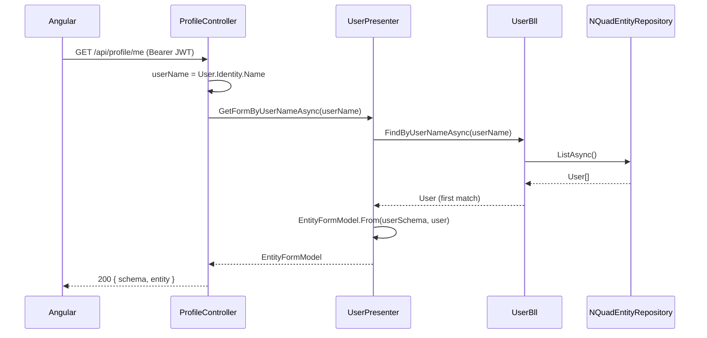

# Stage review: User CRUDL WebApi (login end-to-end objective, stage C)

Date: 2026-09-29. Repo: `ai-research-blog`, branch `claude-cleanup-2026-09-26`. Not yet pushed.

## Why
Login and a profile page already existed, fully wired - but on the older `Adventures.Data`
(Postgres, `entities.standard_fields` JSONB) stack, with a hand-written `ProfileField[]` list that
only knew `email`/`display_name`. This stage moves profile onto the schema-driven
`Adventures.Entities.User`/`EntitySchema`/`NQuadEntityRepository<User>` engine finished in
`Adventures.Foundation` this session, and adds the rest of CRUDL (list/create/update/delete any
user, guarded so nobody can delete their own account). Login itself (`Adventures.Identity`,
Postgres credential store, JWT issuance) is untouched - the bridge is the JWT's Username claim,
looked up against the new store.

## What was built
- **Project references**: `AiBlogResearch.WebApi` now references `Adventures.Entities` and
  `Adventures.Data.NQuad`; `seed.nq` is linked into its output the same way the test projects
  already do.
- **`Program.cs`**: `AddLifetimeServices()` (not called before) turns on the MvpVm reflection
  auto-registration. A singleton `InMemoryNQuadStore`, seeded from `seed.nq` at startup (no
  Postgres N-Quad table yet - matches "start simple"). The User `EntitySchema` is built once via
  `Adventures.Data.NQuad.SchemaDal.Load` against the seeded quads (the legacy schema-description
  convention - still the only way to read it, per the finding from the prior session's stage 3).
  `IEntityRepository<User>` registered as a `NQuadEntityRepository<User>` built from that schema.
- **`IUserPresenter`/`UserPresenter`** (new, `Presenters/`, interface in its own file per your
  feedback): resolves a `User` by id or Username via `IUserBll`, projects it through
  `EntityFormModel.From` into the "standard object" a UI form control renders from. Auto-registered
  (scoped, interface-driven) - not manually wired in `Program.cs`, same as `UserBll` itself.
- **`UsersController`** (new): full CRUDL - `GET/POST /api/users`, `GET/PUT/DELETE /api/users/{id}`.
- **`ProfileController`** (rewritten, same routes so the existing Angular page keeps resolving them):
  `GET/PUT/DELETE /api/profile/me`, resolving the caller by the JWT's Username claim (the same one
  `AuthController.WhoAmI` already reads) rather than the "sub" GUID - that GUID belongs to the older
  Postgres-identity user record, a different id space entirely from the new store's entity id.
  `DeleteMe` always targets the caller's own id, so it always demonstrates the guard.
- **Old `ProfileControllerTests.cs` rewritten** (it no longer compiled against the new constructor
  shape) against a shared `FakeUserPresenter` test double; new `UsersControllerTests.cs` using the
  same fake.

## A real bug the unit tests could not catch, found by an actual startup run
`dotnet run` failed to start: `AddLifetimeServices()`'s reflection scan runs across every loaded
assembly, not just what this host uses, so it also found `Adventures.Entities.SchemaBll` (from the
prior session's work) and registered it - and ASP.NET Core validates every registered service's
dependency graph at `Build()` time in Development, even services nobody requests. `SchemaBll` needs
`IEntityRepository<SchemaEntity>`/`<SchemaFieldEntity>`, which this host never registered. Fixed by
registering both (reusing the same seeded store and each type's own hand-authored `MetaSchema`) -
cheap, and arguably correct regardless (a future schema-admin screen would need them anyway). Worth
knowing going forward: **any** new `Adventures.Entities`/`Adventures.Common` type implementing
`IBll`/`IPresenter` will require every consuming host to satisfy its full dependency graph, even if
unused - not something to design around now, but a real interaction between the broad
"auto-register everything with a lifetime marker" convenience and Development-time DI validation.

## Verified
`dotnet build`/`dotnet test` clean across the whole solution: 228 passing. Then a real
`dotnet run` smoke test (not just fakes): the app now starts cleanly, and anonymous `GET
/api/users`/`GET /api/profile/me` both correctly return 401 (the new controllers are routed and
`[Authorize]`-enforced), `/api/health` still 200s. Full authenticated round-trip (real login against
Postgres, First/Last/Phone/DOB actually showing, the "Claude" user creation) was not run - that
needs a live `ConnectionStrings:Postgres`, which is unrelated to this stage's changes and is
already covered by the existing login test suite.

## Not covered / next
Stage D: Angular. The existing `Profile` page/`ProfileService` still expect the old
`{fields: ProfileField[]}` shape and will not render correctly against the new
`{schema: {...}, entity: {...}}` response until updated - this is the very next piece, not an
oversight.

## Next (your call after review)
Stage D: a reusable Angular `EntityForm` component consuming `EntityFormModel`, `ProfileService`
updated to the new shape, and end-to-end browser verification.
