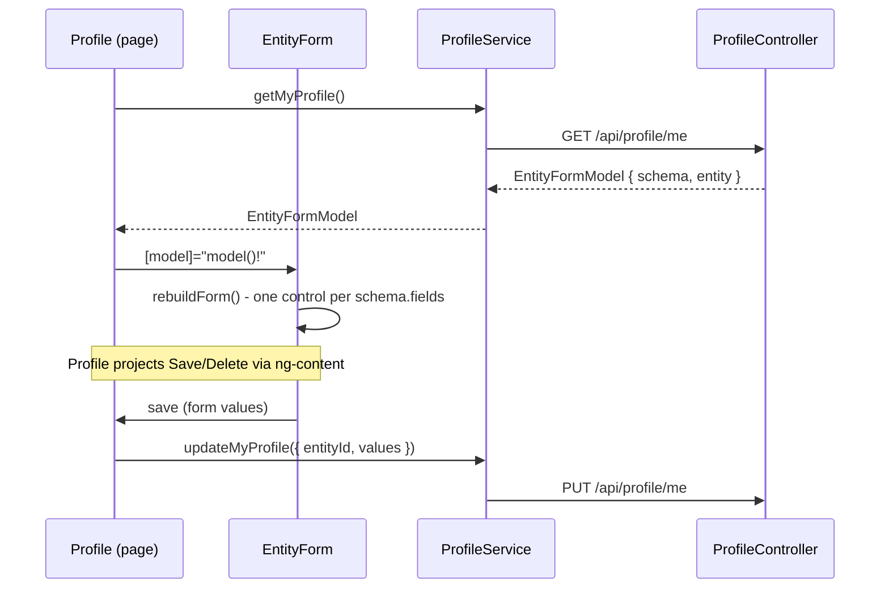

# Stage review: Angular EntityForm (login/profile CRUDL objective, stage D)

Date: 2026-10-01. Repo: `ai-research-blog`, branch `claude-cleanup-2026-09-26`. Not yet pushed.

## Why
Stage C moved the WebApi's profile endpoints onto the schema-driven `Adventures.Entities` stack,
returning `EntityFormModel` (`{ schema, entity }`) instead of the old flat `ProfileField[]` list.
The Angular `Profile` page still expected the old shape and would not render against the new
response. This stage closes that gap and, per your direction, builds the rendering as a reusable
component rather than more page-specific logic.

## What was built
- `models/entity-form.model.ts` (new): `EntityFieldSchema`/`EntitySchemaModel`/`EntityDataModel`/
  `EntityFormModel` - mirrors the C# records exactly (camelCase, as ASP.NET Core serializes them).
  Generic, not profile-specific.
- `components/entity-form/` (new): `EntityForm`, a reusable component that renders one Material
  form field per `schema.fields` entry from the matching `entity.values` entry. No validation yet
  (declared scope) - every field is a plain text input; `isRequired` only drives the visual
  required marker, not a blocking `Validator`. The page hosting it projects its own action buttons
  via `<ng-content>`, so `Profile` owns Save/Delete, not the form shell.
- `services/profile.service.ts`: `getMyProfile`/`updateMyProfile` updated to the new shape; new
  `deleteMyAccount()` (`DELETE /api/profile/me`).
- `pages/profile/`: rewritten to host `EntityForm` and a "Delete my account" action that
  demonstrates the server's delete-own-account guard (the call always targets the caller's own id,
  so it always gets rejected).

## A bug caught by a unit test, not by eyeballing the code
`EntityForm.spec.ts`'s first draft set `fixture.componentInstance.model = ...` directly and called
`ngOnChanges({ model: undefined! })`, assuming that would trigger the same rebuild a real template
binding would. It did not: `changes['model']` evaluated to `undefined` (falsy), so the component's
own `if (changes['model'])` guard never ran `rebuildForm()`, and the template's
`[formControlName]` directives threw "Cannot find control with name" against an empty `FormGroup`.
Fixed in the test, not the component, by passing a real `SimpleChange` instance - the component's
own `ngOnChanges` logic was correct all along; the test was not exercising it the way a real
binding would.

## Verified
`ng build`: clean. `ng test` (3 new facts for `EntityForm`: renders one control per field
pre-filled from entity values, rebuilds on a new model, emits current values on submit) - all
green, including the one caught above, red-first once the real bug (in the test) was found and
fixed. Full `.NET` suite across the solution: 233 passing. Browser, via the built-in preview
(backend not running - a full authenticated round trip needs live Postgres credentials, out of
scope for this stage and unrelated to what changed): confirmed the app loads with no console
errors from the new code, and the existing `/profile` -> `/login` auth-guard redirect still works.

## Not covered / next
- No live, authenticated round trip against a real backend - First/Last/Phone/DOB actually
  appearing, the delete-guard's real HTTP response, creating "Claude" as a second user. Needs a
  dev environment with `ConnectionStrings:Postgres` configured; not attempted here.
- No admin (list/create/delete-other-user) Angular page - `UsersController` is still API-only, per
  the stage C scoping.
- Workspace-local `.claude/launch.json` gained an `ai-blog-research-ui` entry (gitignored, not part
  of this commit) so the built-in browser preview can target this app's dev server by name instead
  of a stale `poc-angular` URL-only entry it was falling back to.

## Summary of the whole login/profile CRUDL objective
Stage A/B (`Adventures.Foundation`): `EntityFormModel`, `UserBll`, `IPresenter` marker. Stage C
(`ai-research-blog`): `UsersController`/`ProfileController` on the new stack, `UserPresenter`,
DI wiring - plus the `AddLifetimeServices` lazy-validation fix it surfaced, landed separately in
`Adventures.Foundation`. Stage D (this one): the Angular side catches up to the new response
shape via a reusable, schema-driven form component. Login/authentication itself was never touched.
